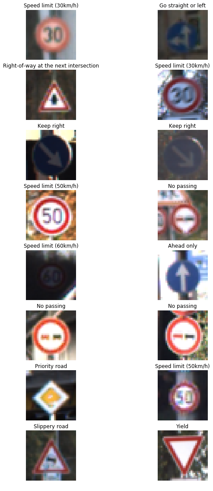
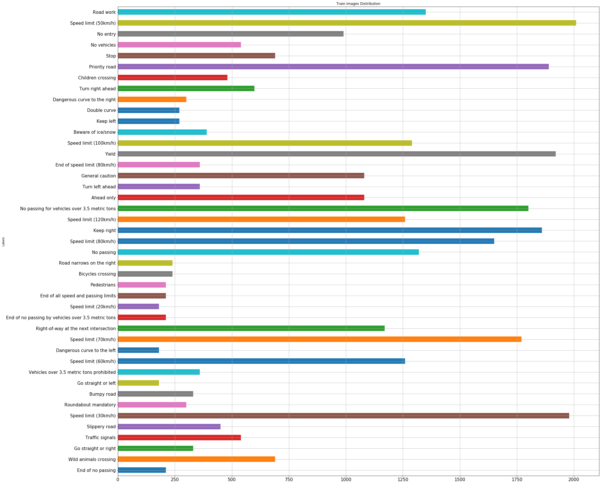
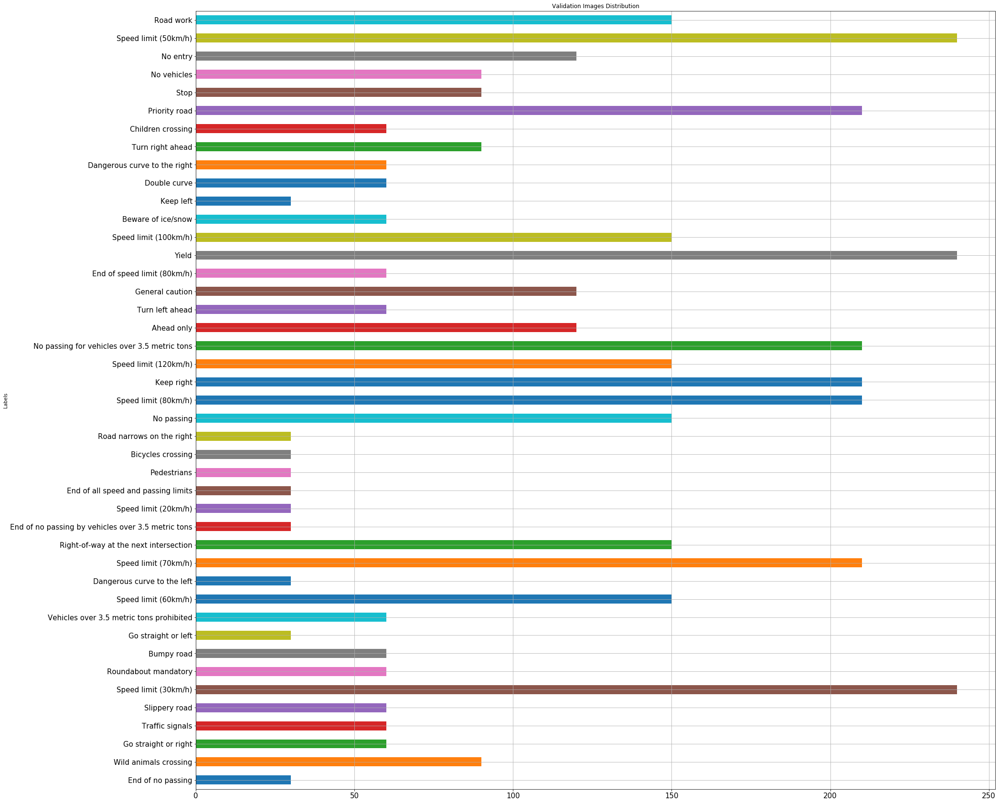
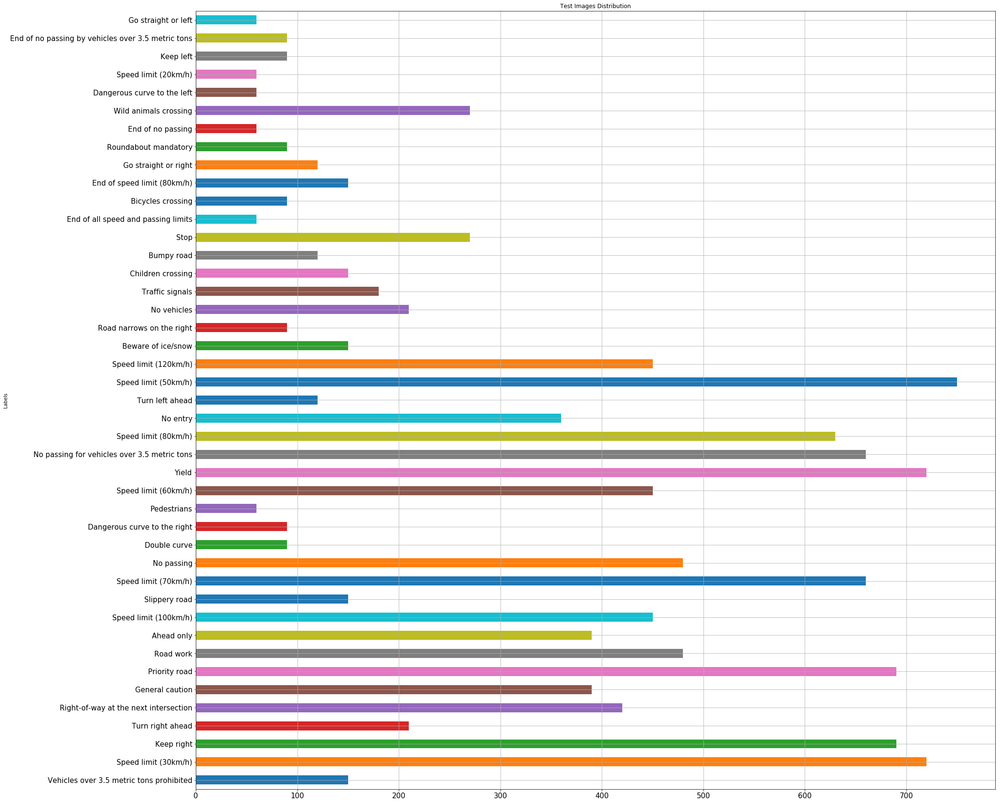
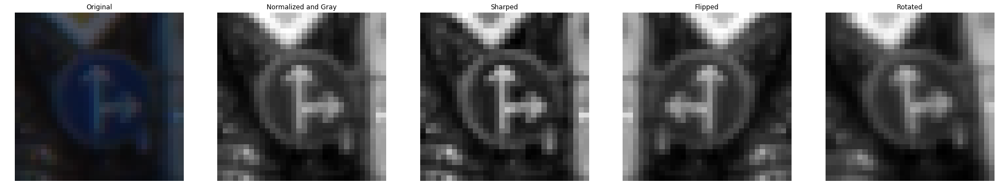
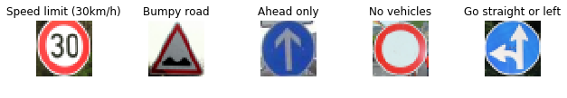
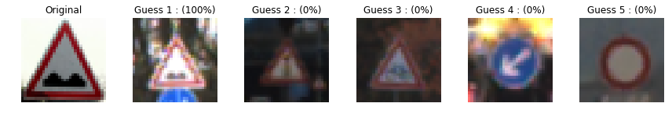
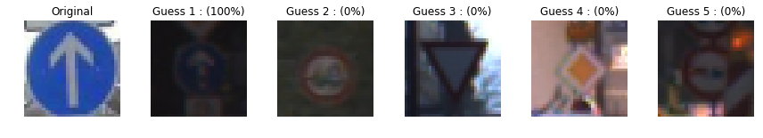
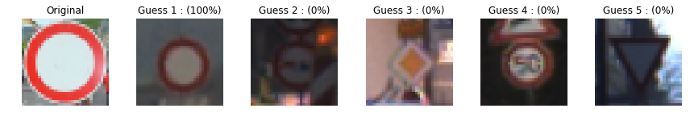
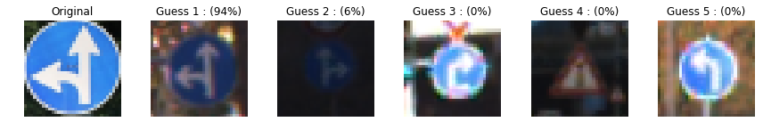

### Traffic Sİgn Classifier


### Data Set Summary Exploration
***
#### 1. Summary of Data
* The size of training set is 139196
* The size of the validation set is 17640
* The size of test set is 50520 
* The shape of a traffic sign image is 32x32x1
* The number of unique classes/labels in the data set is 43

* Random images from dataset


> The distribution of images for each data set shown in bars (Data augmentation included)
***

#### Train
***



#### Valid
***

 

#### Test
***


<end>
    
***

### Design and Test a Model Architecture
***

#### Pipeline of preprocess
1. I decided to convert the images to grayscale and normalized them to increase accuracy. It is more easy to train normalized images. And most of image processing functions accepts only grayscaled images
2. I made some preprocess steps to increase size of dataset. They are flipping, rotating and sharping
3. After the data augmentation:
    - X_train size = 139196
    - X_valid size = 17640
    - X_test size  = 50520
    - Number of Classes = 43
 


#### Model Architecture 
*** 

> The model that I used based on LeNet which is developed by Yann LeCun. I just added 1 conv layer, 2 fully connected layer and change the order of pooling layers.
Also I used dropout method to prevent overfitting.
   
  
| Layer         		|     Description	        					| 
|:---------------------:|:---------------------------------------------:| 
| Input         		| 32x32x1 Grayscale image   					| 
| Conv1 5x5x6    	 	| 1x1 stride, valid padding, outputs: 28x28x6 	|
| RELU					|												|
| Max pooling	      	| 2x2 stride, 2x2 kernel     outputs: 14x14x6 	|
| Conv2 5x5x16      	| 1x1 stride, valid padding, outputs: 10x10x16 	|
| RELU					|												|
| Conv3 5x5x6    	 	| 1x1 stride, valid padding, outputs: 8x8x32 	|
| RELU					|												|
| Max pooling	      	| 2x2 stride, 2x2 kernel     outputs: 4x4x32 	|
| Flatten 				| Output: 512									|
| FC1					| Input: 521 Output: 256						|
| RELU					|												|
| Dropout 				| Keep prob = 0.5  								|
| FC2					| Input: 256 Output: 128						|
| RELU					|												|
| Dropout 				| Keep prob = 0.5  								|
| FC3					| Input: 128 Output: 64 						|
| RELU					|												|
| Dropout 				| Keep prob = 0.5  								|
| FC2					| Input: 64 Output: 43  						|
|	 				  	|												|


#### Training
***
The below parameters are similar to the ones used in LeNet. 

   - EPOCHS = 25
   - BATCH_SIZE = 128
   - learning rate = 0.001
   - Dropout Probability = 0.5
   - The name of model = vefakNet
   - Normalizer = Softmax
   - Optimizer = Adam
    

#### Results

My final model results were:
* training set accuracy of **%99.6**
* validation set accuracy of **%95.7**
* test set accuracy of **%95.1**

If an iterative approach was chosen:
* What was the first architecture that was tried and why was it chosen?
   
  I used LeNet firstly which is recommended by instructors
* What were some problems with the initial architecture?
  
  There is no dropout layers which can cause overfitting.
* How was the architecture adjusted and why was it adjusted? Typical adjustments 
  
  I added one more conv and two more fully connected layer. So the number of learning parameters are greatly increased. Then I added droput layer with keep prob =0.5. Also I tried it with 0.25, 0.40 and 0.70 but 0.5 is the best one.
 
* Which parameters were tuned? How were they adjusted and why?
  
  I tuned dropout, number of images in dataset, learning rate, batch size and epoch. Increasing batch size, dataset and epochs effected in goodway. I tried different value of learning rate and 0.001 is gave best result
    
* What are some of the important design choices and why were they chosen? For example, why might a convolution layer work well with this problem? How might a dropout layer help with creating a successful model?
  
  The dataset consist of conv layers. The best and easiest option to obtain the information from images is conv layers. Droput is a great technique for overfitting. It kills random weights. 

If a well known architecture was chosen:
* What architecture was chosen?
    
    GoogLeNet
* Why did you believe it would be relevant to the traffic sign application?
    
    It has large size of parameters but thanks to its architecture it doesnot affect computational cost. GoogLeNet also known for classiying images well.
* How does the final model's accuracy on the training, validation and test set provide evidence that the model is working well?
   
   We can say that the model works well because the results are consistent among themselves.
 

### Test a Model on New Images

#### 1. The five traffic sign images to be tested

Here are five German traffic signs that I found on the web:




#### 2. Predictions

Here are the results of the prediction:

| Image			        |     Prediction	        					| 
|:---------------------:|:---------------------------------------------:| 
| Speed Limit (30km/h)  | Speed Limit (30km/h) 							| 
| Bumpy Road 			| Bumpy Road 									|
| Ahead Only			| Ahead Only									|
| No Vehicles      		| No Vehicles					 				|
| Go straight or left	| Go straight or left   						|


The model was able to correctly guess 5 of the 5 traffic signs, which gives an accuracy of 100%. 

**Output of performance analysis:**
```python
INFO:tensorflow:Restoring parameters from ./lenet
Image 1
Image Accuracy = 1.000

INFO:tensorflow:Restoring parameters from ./lenet
Image 2
Image Accuracy = 1.000

INFO:tensorflow:Restoring parameters from ./lenet
Image 3
Image Accuracy = 1.000

INFO:tensorflow:Restoring parameters from ./lenet
Image 4
Image Accuracy = 1.000

INFO:tensorflow:Restoring parameters from ./lenet
Image 5
Image Accuracy = 1.000
```

#### 3. Softmax probabilities for each prediction.  
> Instead of table I used figures to represent softmax probabilities for each test images
Here results:

")






